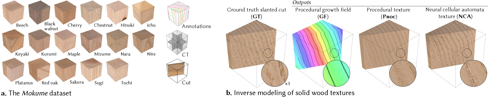

# The Mokume Dataset and Inverse Modeling of Solid Wood Textures

This repository is associated with the journal paper "The Mokume Dataset and Inverse Modeling of Solid Wood Textures" presented at SIGGRAPH 2025 ([PDF](https://www.ma-la.com/mokume/preprint_paper.pdf), [DOI](https://doi.org/10.1145/3730874)).
The full dataset and outputs are hosted elsewhere (**INSERT LINK**). The code is hosted in this repository.




***a.*** *Overview of the diverse wood species covered by the Mokume dataset.*
***b.*** *This data is used for training and evaluation of an inverse modeling pipeline for solid wood textures. Our method first segements the annual ring pattern and then compute a compatible procedural volumetric growth field (GF) in which the annual-rings are iso-curves/surfaces. We showcase two ways to transform this representation into a detailed 3D texture: an efficient inverse procedural model (Proc) with support for point-wise evaluation, and a versatile but resource-intensive neural cellular automaton (NCA).*

## Paper Abstract

We present the Mokume dataset for solid wood texturing consisting of 190 cube-shaped samples of various hard and softwood species documented by high-resolution exterior photographs, annual ring annotations, and volumetric computed tomography (CT) scans. A subset of samples further includes photographs along slanted cuts through the cube for validation purposes.


Using this dataset, we propose a three-stage inverse modeling pipeline to infer solid wood textures using only exterior photographs. Our method begins by evaluating a neural model to localize year rings on the cube face photographs. We then extend these exterior 2D observations into a globally consistent 3D representation by optimizing a procedural growth field using a novel iso-contour loss. Finally, we synthesize a detailed volumetric color texture from the growth field. For this last step, we propose two methods with different efficiency and quality characteristics: a fast inverse procedural texture method, and a neural cellular automaton (NCA). 


We demonstrate the synergy between the Mokume dataset and the proposed algorithms through comprehensive comparisons with unseen captured data. We also present experiments demonstrating the efficiency of our pipeline’s components against ablations and baselines. 

## How to run the code

### Environment setup

- Python 3.13.0

- PyTorch 2.7.1, CUDA 11.8

- Opencv 4.11.0

- matplotlib 3.10.3

- tqdm 4.67.1

- ...

- ...

### System Outline

**Step 1:** Train the U-Net (this step can be skipped by instead downloading a trained model)
- Input: Image pair training data (ImagePairs/training_data). Download formated dataset here **INSERT LINK**.
- Output: Train image translation model (unet_output/unet_trained_model.pt)
```
python 1_train_unet.py
```

**Step 2:** Apply the U-Net to translate wood photographs to annual ring localization images
- Input 1: Trained model (unet_trained_model.pt). Train the model yourself (step 1) or download an already trained model here **INSERT LINK**.
- Input 2: Photographs of the six faces of the cube samples (Samples/XXNN/A_col.png, ..., F_col.png, where *XXNN* is a sample ID, such as *CN03*)
- Output: Annual ring localization images of each face (Samples/XXNN/A_arl-unet.png, ..., F_arl-unet.png)
```
python 2_apply_unet.py -sample CN03
```

**Step 3:** Infer the volumetric growth field of the sample and its color initalization
- Input 1: Photographs of the six faces of the cube samples (Samples/XXNN/A_col.png, ..., F_col.png)
- Input 2: Annual ring localization images of each face (Samples/XXNN/A_arl-unet.png, ..., F_arl-unet.png)
- Output: ...
```
python 3_infer_gf.py -sample CN03
```

**Step 4a:** Run the texture synthesis appraoch 1: inverse procedural texturing
- Input: ...
- Output: ...
```
python 4a_proc.py -sample CN03
```

**Step 4b:** Train and apply texture synthesis approach 2: neural cellular automata (not dependent on step 4a)
- Input: ...
- Output: ...
```
python 4b_nca.py -sample CN03
```

**Step 5:** Run file *5_show_outputs* to visualize the outputs
- Input: ...
- Output: ...
```
python 5_show_outputs.py -sample CN03
```

## Resources

Project website: https://mokumeproject.github.io/

PDF: https://www.ma-la.com/mokume/preprint_paper.pdf 

DOI: https://doi.org/10.1145/3730874

Dataset: **INSERT LINK**

Results: **INSERT LINK**

### Reference

Maria Larsson, Hodaka Yamaguchi, Ehsan Pajouheshgar, I-Chao Shen, Kenji Tojo, Chia-Ming Chang, Lars Hansson, Olof Broman, Takashi Ijiri, Ariel Shamir, Wenzel Jakob, and Takeo Igarashi. 2025. The Mokume Dataset and Inverse Modeling of Solid Wood Textures. ACM Trans. Graph. 44, 4 (August 2025), 18 pages. https://doi.org/10.1145/3730874

### BibTex
```
INSERT BIBTEX CODE
```